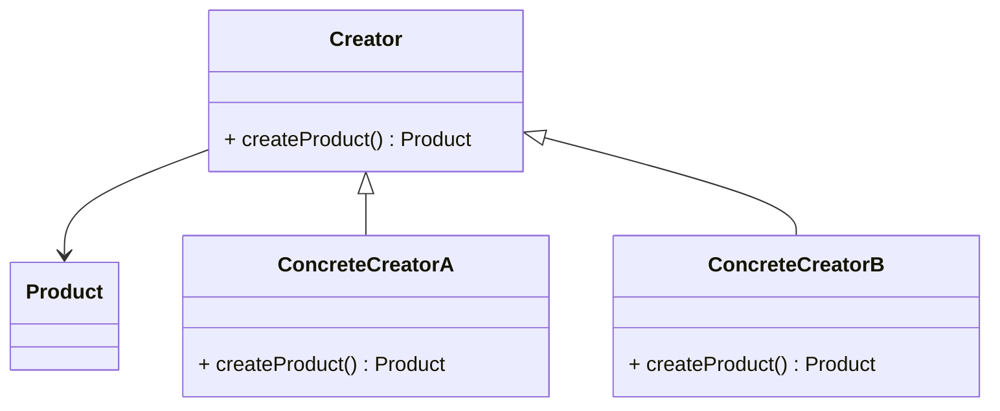

# Фабричный метод

## Другие названия

- Виртуальный конструктор
- Factory Method

## Семейство

Порождающий

## Определение

**Фабричный метод** — это порождающий паттерн проектирования, который определяет общий интерфейс для создания объектов в суперклассе, позволяя подклассам изменять тип создаваемых объектов.

